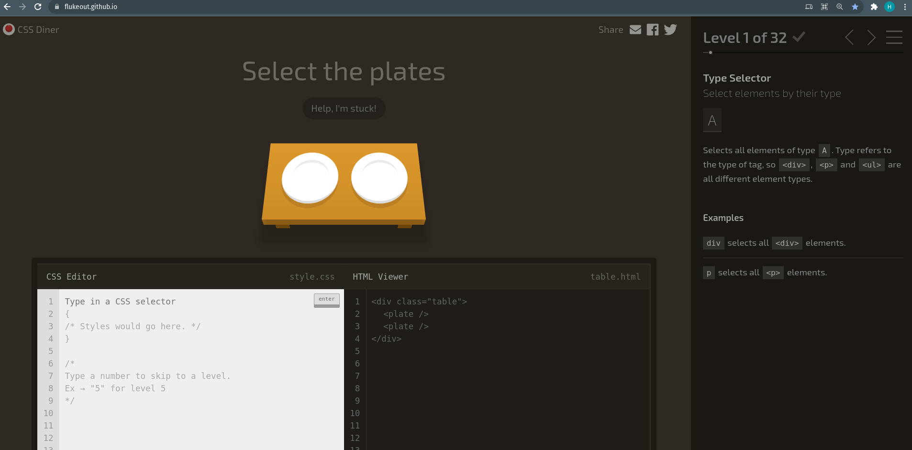
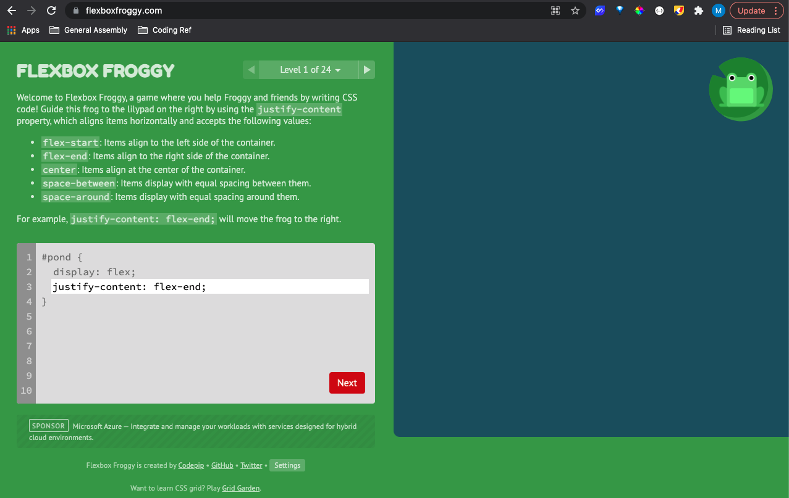

# CSS Diner and Flexbox Froggy 

## Preparation
For this deliverable please Fork and Clone this repo. 

To submit the assignment, you will submit a Pull Request.

If you need a refresher, consult this guide on [Submitting Deliverables](https://github.com/SEIR-11-08/deliverable-submissions).

## Objective
For this assignment, you will be playing the [CSS Diner](https://flukeout.github.io/) and [Flexbox Froggy](https://flexboxfroggy.com/) games.

For each game, progress to the furthest level you can and take a screenshot of your final level once complete.

You will move one screenshot for CSS Diner, and one screenshot for Flexbox Froggy into this repository and submit your Pull Request.

---

## CSS Diner
[CSS Diner](https://flukeout.github.io/) is a fun game where you can learn to use CSS Selectors!

## Flexbox Froggy
[Flexbox Froggy](https://flexboxfroggy.com/) is an excellent resource to get up and running with CSS Flexbox.

---

## Quick screenshots guide:
[Apple's Screenshot Guide Page](https://support.apple.com/en-us/HT201361)

Command key ⌘ + Shift + 4

[Windows' Screenshot Guide Page](https://support.microsoft.com/en-us/windows/how-to-take-and-annotate-screenshots-on-windows-10-ca08e124-cc30-2579-3e55-6db63e36fbb9)

Windows logo key + Shift + S 
